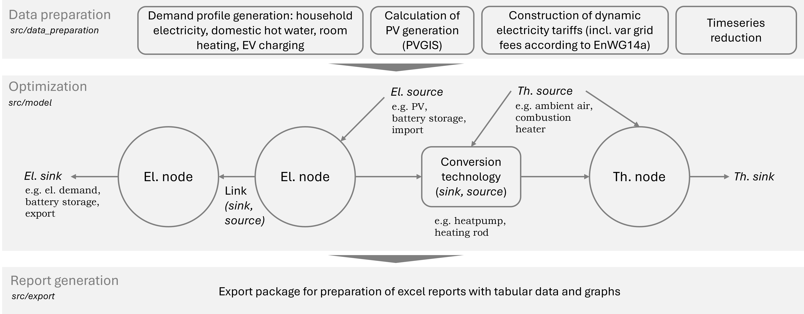

# P2Bldg — Building Energy Systen Optimization Framework

P2Bldg ("Power to Building") is a Python framework for the integrated optimization of building energy systems.
It features energy system components, such as PV, battery storage, heat pumps, thermal storages, and other heating 
systems. The framework constructs and solves mixed-integer linear programming (MILP) models using Pyomo, 
allowing for detailed techno-economic optimization of building energy systems under various scenarios. 
Timeseries for loads, generation, and prices can be calculated inherently or externally given.

Features
--------
- Integrated electrical and thermal energy system modeling.
- Techno-economic optimization via MILP using Pyomo.
- Flexible time resolution: hourly, quarter-hourly, computational efficiency via timeseries reduction 
(selection of reference weeks)
- Inherent calculation of demand profiles, notably room heating demands considering transmission and ventilation losses 
as well as solar and internal gains
- Support for dynamic tariffs, variable grid fees (EnWG14a)
- Detailed building energy system component modeling: PV, battery storages, solar thermal, heat pumps, thermal storages, direct electric 
heating, combustion heaters (e.g. gas boiler), EV wallboxes
- Consideration of temperature levels and heating curves
- Optimization of refurbishment measures (e.g. insulation, window replacement)
- Integration of CO2 emissions and prices
- Creation of ` .xlsx` reports with charts included
- Modular structure for easy extension and adaptation to new use cases

------------
Architecture
------------
The framework is structured modularly, with separate modules for data preparation, model formulation, 
and result processing. The functionality of these modules can be used to solve customized energy system optimization 
problems. The following diagram illustrates the main components and their interactions:

In the `src` folder two example routines are provided for different use cases:
- `run_building_opt.py`: Integrated building energy system optimization
- `run_battery_opt.py`: PV + Battery storage optimization

These are described under [src/README.md](src/README.md). A detailed documentation of the source code 
can be found under [p2bldg.readthedocs](https://p2bldg.readthedocs.io/en/latest/).

-------------------
Quick prerequisites
-------------------
1. Python 3.11 (or compatible).
2. Internet connection for data collection (PVGIS) and remote solving (NEOS server).
3. Optional: Local solver (e.g. glpk, cbc, cplex, gurobi)

Install (Windows)
-------
1. Clone repository : ``git clone <repo-url> cd P2Bldg``(git bash) or download zip and extract.
2. Run ``setup_env.bat`` (by double-clicking) to create virtual environment and install dependencies
3. Configure access to NEOS solver (add your e-mail address under `os.environ['NEOS_EMAIL']` in ``src/config.py``) 
or install local solver (e.g. glpk, cbc, cplex, gurobi).

How to run
----------
Different example routines (`run_building_opt.py`,`run_battery_opt.py`) have been created using the functionality 
of the different modules. How to run these is described under [src/README.md](src/README.md).

---------------------
External dependencies
---------------------
- Climate data and PV generation timeseries are retrieved from [PVGIS](https://re.jrc.ec.europa.eu/pvg_tools/en/).
- Domestic hot water load profiles have been generated with [DHWcalc](https://www.uni-kassel.de/maschinenbau/institute/thermische-energietechnik/fachgebiete/solar-und-anlagentechnik/downloads.html).
- Household electricity load profiles have been generated with the [synPRO](https://synpro-lastprofile.de/) tool from Fraunhofer ISE.
- Electricity price profiles are obtained from [energy-charts.info](https://www.energy-charts.info/).

