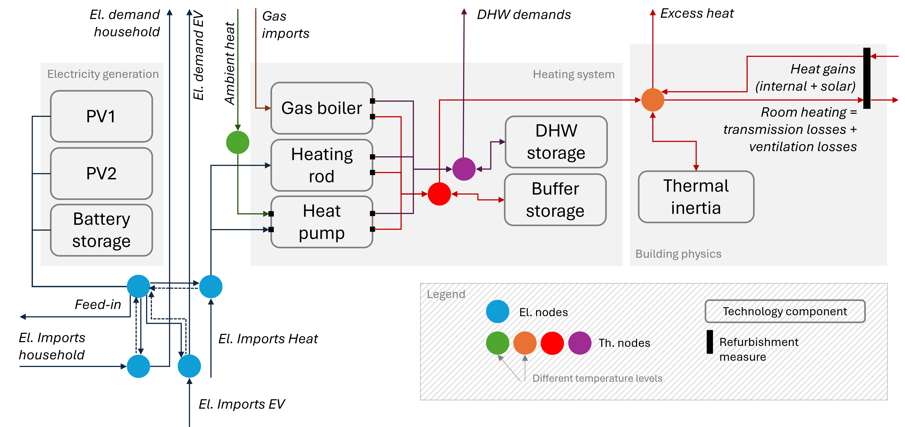

# Integrated building energy system optimization 
`run_building_opt.py` *also see source code documentation at [p2bldg.readthedocs/run_building_opt.py](https://p2bldg.readthedocs.io/en/latest/run_building_opt.html)*

This routine performs an integrated optimization of building energy systems, considering both electrical and thermal 
demands, generation, and storage options. The following figure illustrates the system components considered in 
the optimization:

In order to enable short computation times, a timeseries reduction method is applied, selecting representative weeks 
for each season bassed on climate data for several years.

The input data for the optimization is read from an Excel workbook located in `data/input/`. An example input file 
(`example_building_opt_input.xlsx`) is provided in the repository. Descriptions of the input parameters can be found in 
the workbook. The given example features 4 different scenarios: 
- **BAU** (business as usual) with no PV and gas boilers
- **PV+HP** with PV + BESS (battery electric storage system) and a heatpump (HP)
- **Refurbishment** with PV, BESS and HP and a refurbishment measure (wall insulation)
- **Flex** with PV, BESS, HP and optional refurbishment using a dynamic electiricity tariff also featuring 
exemplary variable grid fees according to EnWG14a

The results are written to a seperate result folder under `data/output/results` for each run. A result folder contains 
- an analysis of climate data parameters (`ClimateDataAnalysis_**.xlsx`). It calculates heating degree days, 
cooling degree days, solar irradiation and ambient temperatures for several years and compares 
the selected representative weeks to average, min. and max. values.
- A copy of the input data used (`InputData.xlsx`)
- Detailed results for each scenario (`OutputDetailed_*scenario*.xlsx`)
- A summary of key results across scenarios (`OutputSummary.xlsx`)

A log file for each run is written to `data/output/logs`.

How to run `run_building_opt` (Windows)
----------------------------

1. Fill in data into example input file (or copy input data file and rename. Make sure to update `proj_name` in 
`run_building_opt.py`).
2. Run `run_building_opt.bat` (by double-clicking) to activate the virtual environment and run the script.
(the calculation of one scenario takes approx. 2mins -> ~10mins for a complete run).
3. Outputs are written to `data/output/results`.

# PV + BESS optimization 
`run_battery_opt.py` *also see source code documentation at [p2bldg.readthedocs/run_battery_opt.py](https://p2bldg.readthedocs.io/en/latest/run_battery_opt.html)*

This simpler routine performs an optimization of a PV + Battery Energy Storage System (BESS) for a building or facility. 
The optimization is performed for a full year in quarter-hourly resolution. Timeseries for electrical load, PV generation 
and prices need to be provided in the input file. Special electricty tariffs for specific time windows can be considered
(Hochlastzeitfenster, atypische Netznutzung). Per defaults 5 different scenarios are calculated:
- Static electricity tariff without BESS (only PV system)
- Static electricity tariff with BESS
- Static electricity tariff + atypical usage grid fee tariff (atypische Netznutzung) with BESS
- Dynamic tariff with BESS
- Dynamic tariff + atypical usage grid fee tariff with BESS
In order to change the scenarios the source code in `run_battery_opt.py` needs to be adjusted.

The input data for the optimization is read from an Excel workbook located in `data/input/`. An example input file 
(`example_battery_opt_input.xlsx`) is provided in the repository. Descriptions of the input parameters can be found in 
the workbook. 

The results are written to an .xslx file under `data/output/results` for each run. An example is given under 
`Example_battery_opt.xlsx`. A log file for each run is written to `data/output/logs`.

How to run `run_battery_opt` (Windows)
----------------------------
1. Fill in data into example input file (or copy input data file and rename. Make sure to update `proj_name` in 
`run_battery_opt.py`).
2. Activate `m.atypical_consumption` and `m.hltf_p_max` constraints by uncommenting the respective lines in `src/model/pyomo_model.py`.
3. Run `run_building_opt.bat` (by double-clicking) to activate the virtual environment and run the script.
(the calculation of one scenario takes approx. 4mins -> ~20mins for a complete run).
4. Outputs are written to `data/output/results`.

# Notes

- By default the example uses NEOS/CPLEX in the project; to use a local solver, edit the solver call in 
`run_building_opt.run_scenario`/`run_battery_opt.run_scenario` (see commented lines).
- Make sure to configure NEOS solver access in `src/config.py` (add your e-mail address under `os.environ['NEOS_EMAIL']`).

# Troubleshooting

- If you want to run ``run_building_opt.py`` without timeseries reduction for a full year, the optimization problem will
be too large to be solved on NEOS. In this case, install a local solver (e.g. cplex, gurobi). Depending on the solver 
and the machine used, the computation time can be several hours. (This routine has not been tested for local solvers yet).
- In rare cases storages have shown charging and discharging behaviour at the same timestep. This does not compromise 
obtained results strongly, as energy balances will still be fullfilled. Only higher losses will occur. Up to now, no 
reason for this behaviour has been found.
- In case of any issues, contact the repository maintainer.

